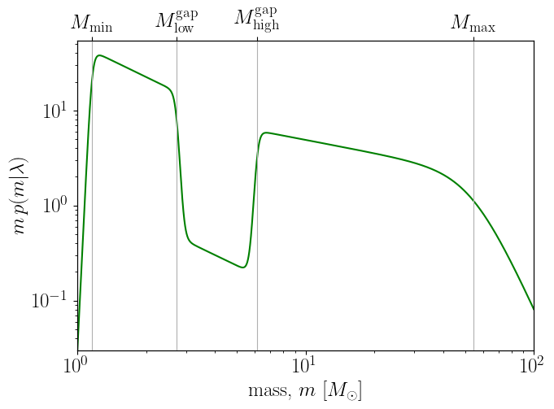

.. _observing_scenarios:
=============================
GWTC-3 Distribution and Observing Scenario Simulation Pipeline
=============================

Introduction
============

This section describes the process of generating compact binary coalescence (CBC) event populations from the GWTC-3 distribution (Power Law + Dip + Break),
as well as the simulation pipeline used to reproduce observation scenarios during the O4 and O5 campaigns of the LIGO-Virgo-KAGRA network (LVK).

Population Modeling: GWTC-3 (PDB) Distribution
==============================================

The so-called GWTC-3 distribution (Power Law + Dip + Break, PDB) provides an empirical description of the compact object population based on the GWTC-3 catalog data.
This modeling has the following features:

- **Components**: All CBC systems (BNS, NSBH, BBH) are described by a continuous mass distribution, without prior separation.
- **Distribution shape**: The mass function follows a broken power law, with the possibility of a “dip” in the intermediate region to model a potential mass gap between neutron stars and black holes.
- **Tapering**: Cutoff functions are applied at low and high masses to reproduce the observed behavior at the ends of the distribution.
- **Pairing function**: Primary and secondary masses for each system are drawn from the distribution and paired via a law depending on the mass ratio, favoring realistic binary formation.
- **Spin distribution**: Spin magnitudes are drawn uniformly, and their directions are assumed isotropic. Ranges differ depending on the mass of the objects (see :footcite:`2016A&A...594A..13P` for details).

PDB Mass Distribution
=====================

The figure below shows the 1D Power Law + Dip + Break (PDB) mass distribution...

   The 1D PDB mass distribution :math:`p(m|\lambda)` in the range  :math:`[1, 100]\,\, {M}_\odot`, for a representative set of hyperparameters :math:`\lambda`.
   (See the  Table 7 in Appendix A.1 of :footcite:`2023ApJ...958..158K` for the full parameter values).

The model is based on :footcite:`2022ApJ...931..108F`, applied to the GWTC-3 distribution :footcite:`2023PhRvX..13a1048A`, and implemented in our simulations as described in :footcite:`2023ApJ...958..158K`.

Observation Scenario Simulation
===============================

Our simulations explore multiple detector configurations and signal-to-noise (SNR) thresholds to estimate (GW) detection rates under realistic observing conditions:

a. **SNR threshold of 8**

- The **HL configuration**, deployed during the O4a observing run, the simulations data are available at `Zenodo <https://doi.org/10.5281/zenodo.10078926>`_.
- The **HLVK configuration**, planned for O4 and O5,  results are in `Zenodo <https://doi.org/10.5281/zenodo.7026209>`_.
- We also simulate **HLV and HV configurations** for O5 to assess the effect of detector configurations, including scenarios where only one LIGO detector is operating, the simulation data are located in `zenodo <https://zenodo.org/records/15617982>`_.

b. **SNR threshold of 10**

- The **HLVK configuration** for the upcoming O5 and O6 runs is used to estimate detection rates based on a more conservative detectability threshold, reflecting planned pipeline improvements and noise rejection strategies.

The simulation pipeline follows these steps:

1. **Population sampling**
A large number of binary systems (e.g., :math:`10^6`) are generated by drawing their masses and spins according to the PDB distribution described above. Orientation parameters and comoving volume positions are also drawn uniformly and isotropically.

2. **Gravitational-wave detection simulation**:
- The generated signals are subject to a detectability threshold based on the signal-to-noise ratio (SNR) for each detector network, corresponding to the O4 or O5 configurations.
- Instrumental noise is simulated from the published `sensitivity curves (PSD) for each detector <https://dcc.ligo.org/T2200043-v3/public>`_.
- Detector duty cycles are realistically accounted for.

3. **Source localization**

- Events passing the SNR threshold are localized on the sky using the ``ligo.skymap`` toolchain (e.g., :doc:`bayestar-localize-coincs <ligo.skymap:tool/bayestar_localize_coincs.html#offline-localization-bayestar-localize-coincs>` or :func:`ligo.skymap.bayestar_localize_coincs`), producing a sky probability map and distance estimate for each event.
- Credible regions (e.g., 90%) and the comoving distance distribution are extracted for each simulated event.

4. **Observation scenario preparation**

- The properties of the simulated events (localization, distance, etc.) serve as the basis for defining various electromagnetic (EM) observation scenarios, according to the capabilities of the planned follow-up instruments.
- This pipeline allows evaluation, for each instrumental configuration, of the probability of covering the EM counterpart of a given gravitational-wave event.

The results of these simulations are used to update the :doc:`Observing Capabilities <userguide:capabilities>`

Tools and Resources
====================

- The simulation pipeline primarily relies on the :doc:`ligo.skymap <ligo.skymap>` software suite.
- The scripts used to reproduce the entire population generation and simulation process are publicly available on GitHub (cf. https://github.com/lpsinger/observing-scenarios-simulations).
- Sensitivity curves and other configuration parameters are drawn from official IGWN consortium publications.

.. note::

    This page only describes the methodology for population generation and the simulation pipeline. For results and quantitative analysis,
    srefer to the corresponding section :footcite:`2023ApJ...958..158K`.

=================================
Zenodo GW Injection Data Unpacker
=================================

.. note::
    Here we show  how to easily unpacking, filtering, and conversion of injection datasets
    (e.g., GWTC-3) from Zenodo ZIP archives. It processes event tables and associated
    localization files for specific observing runs (e.g., O5, O6), and outputs
    filtered ECSV tables and organized FITS files.

Usage
-----

You can run this unpacker from the command line as follows:

.. code-block:: bash

   python scenarios/zenodo_unpacker.py --zip runs_SNR-10.zip --subdir runs_SNR-10 --runs O5 O6 --detectors HLVK --outdir ./data --mass-threshold 3

Or use a config file:

.. code-block:: bash

    python scenarios/zenodo_unpacker.py --config params.ini

Or import and call `process_zip()` in your Python code.

Config file example (`params.ini`)
----------------------------------
[params]
zip = runs_SNR-10.zip
subdir = runs_SNR-10
runs = O5 O6
detectors = HLVK
data_dir = data
skymap_dir = skymaps
mass_threshold = 3.0

Source
------

Zenodo Dataset: https://zenodo.org/records/14585837

.. .. literalinclude:: ../../scenarios/zenodo_unpacker.py
..    :language: python
..    :caption: Full code of `zenodo_unpacker.py`

Module Reference
----------------

.. automodapi:: scenarios.zenodo_unpacker
   .. :show-inheritance:
   .. :members:
   .. :private-members:
   .. :undoc-members:
   .. :special-members: __init__, __call__
   .. :exclude-members: __weakref__, __dict__, __module__, __class__

==========
References
==========

.. footbibliography::
